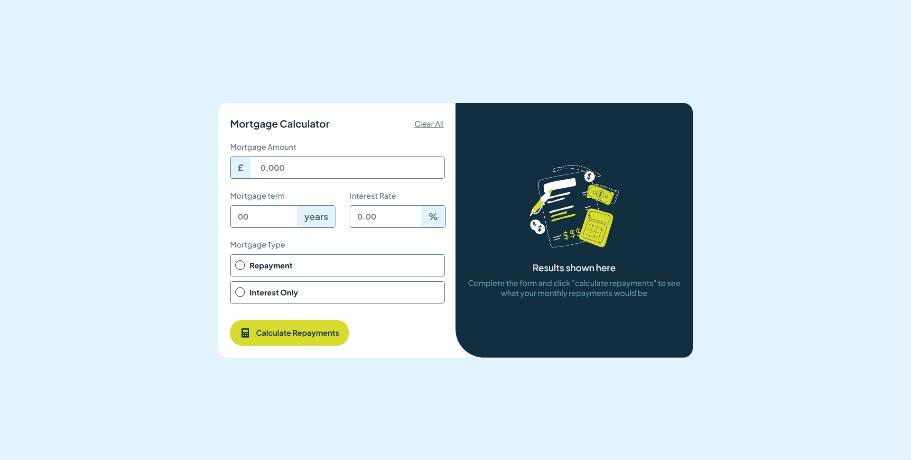

# Frontend Mentor - Mortgage repayment calculator solution

This is a solution to the [Mortgage repayment calculator challenge on Frontend Mentor](https://www.frontendmentor.io/challenges/mortgage-repayment-calculator-Galx1LXK73). Frontend Mentor challenges help you improve your coding skills by building realistic projects.

## Overview

### The challenge

Users should be able to:

- Input mortgage information and see monthly repayment and total repayment amounts after submitting the form
- See form validation messages if any field is incomplete
- Complete the form only using their keyboard
- View the optimal layout for the interface depending on their device's screen size
- See hover and focus states for all interactive elements on the page

### Screenshot



### Links

- Solution URL: [Add solution URL here](https://github.com/dvd1337/refund-calculator/tree/main/src)
- Live Site URL: [Add live site URL here](https://dvd1337.github.io/refund-calculator/)

## My process

### Built with

- Semantic HTML5 markup
- CSS custom properties
- Flexbox
- [React](https://reactjs.org/) - JS library
- [Next.js](https://nextjs.org/) - React framework

### What I learned

I've learnt to think faster when using the useState()

Snippet example:

```jsx
const [isYearsFocused, setIsYearsFocused] = useState(false);

return (
    <>
        <div
          id="yearsCase"
          style={{
            borderColor: isYearsFocused
              ? "var(--colorLime)"
              : error && "red",
          }}
        >
        <label
            id="yearsText"
            htmlFor="getYears"
            style={{
              backgroundColor: isYearsFocused
                ? "var(--colorLime)"
                : error && "red",
              color: isYearsFocused
                ? "var(--colorSlate900)"
                : error && "white",
            }}
          >
    </>
)
```

### Continued development

I want to improve my skills in the prototype mechanics of react, it's been very useful, and above all I want to start thinking faster.

### Useful resources

- [FlexBox](https://origamid.com/projetos/flexbox-guia-completo/) - This is a flexbox guide
- [Prototype](https://legacy.reactjs.org/docs/typechecking-with-proptypes.html) - Prototyping guide in react

## Author

- Website - [David Santos](https://dvd1337.github.io/sites/)
- Frontend Mentor - [@dvd1337](https://www.frontendmentor.io/profile/dvd1337)
- X - [@DillNTC](https://x.com/DiIlNTC)
